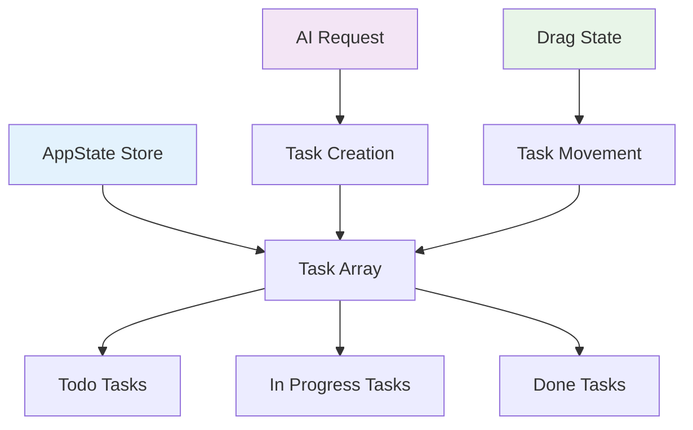

# Data Models

## Task

**Purpose:** Represents individual task cards in the Kanban board with all required fields for functionality and AI enhancement.

**Key Attributes:**

- **id**: string - Unique identifier for the task
- **title**: string - Human-readable task title (required)
- **description**: string - Detailed task description (optional)
- **status**: TaskStatus - Current column position (To Do, In Progress, Done)
- **priority**: Priority - Task priority level (High, Medium, Low)
- **dueDate**: Date | null - Optional deadline for the task
- **createdAt**: Date - Task creation timestamp
- **updatedAt**: Date - Last modification timestamp
- **aiGenerated**: boolean - Flag indicating if task was created via AI
- **originalPrompt**: string | null - Original natural language input if AI-generated

### TypeScript Interface

```typescript
export interface Task {
	id: string
	title: string
	description: string
	status: TaskStatus
	priority: Priority
	dueDate: Date | null
	createdAt: Date
	updatedAt: Date
	aiGenerated: boolean
	originalPrompt: string | null
}

export type TaskStatus = 'todo' | 'in-progress' | 'done'
export type Priority = 'high' | 'medium' | 'low'
```

### Relationships

- **No direct relationships** - Simple flat structure for demonstration
- **Grouping by status** - Tasks organized by TaskStatus enum values
- **Temporal relationships** - Ordered by createdAt, updatedAt timestamps

## AIRequest

**Purpose:** Tracks AI interactions for task creation and search to support error handling and user experience.

**Key Attributes:**

- **id**: string - Unique identifier for the AI request
- **type**: AIRequestType - Type of AI operation (create, search)
- **input**: string - User's natural language input
- **output**: string | null - AI-generated response
- **status**: RequestStatus - Current request state
- **timestamp**: Date - When the request was made
- **error**: string | null - Error message if request failed

### TypeScript Interface

```typescript
export interface AIRequest {
	id: string
	type: AIRequestType
	input: string
	output: string | null
	status: RequestStatus
	timestamp: Date
	error: string | null
}

export type AIRequestType = 'create' | 'search'
export type RequestStatus = 'pending' | 'completed' | 'failed'
```

### Relationships

- **Links to Task** - AIRequest.output contains task data when type is 'create'
- **Search Results** - When type is 'search', output contains matching task IDs

## AppState

**Purpose:** Global application state management for UI state and data synchronization.

**Key Attributes:**

- **tasks**: Task[] - Array of all tasks in the application
- **filter**: string - Current search/filter query
- **isLoading**: boolean - Global loading state for AI operations
- **error**: string | null - Global error message
- **dragState**: DragState | null - Current drag operation state

### TypeScript Interface

```typescript
export interface AppState {
	tasks: Task[]
	filter: string
	isLoading: boolean
	error: string | null
	dragState: DragState | null
}

export interface DragState {
	taskId: string
	sourceStatus: TaskStatus
	targetStatus: TaskStatus | null
}
```

### Relationships

- **Contains Tasks** - AppState.tasks array holds all Task instances
- **Manages UI State** - Controls loading, error, and drag states across components

## Data Flow



## Implementation Notes

- All models use TypeScript strict mode for type safety
- Data persistence handled via localStorage for demonstration
- State management through Svelte stores for reactivity
- All timestamps use ISO 8601 format
- IDs generated using UUID v4 format